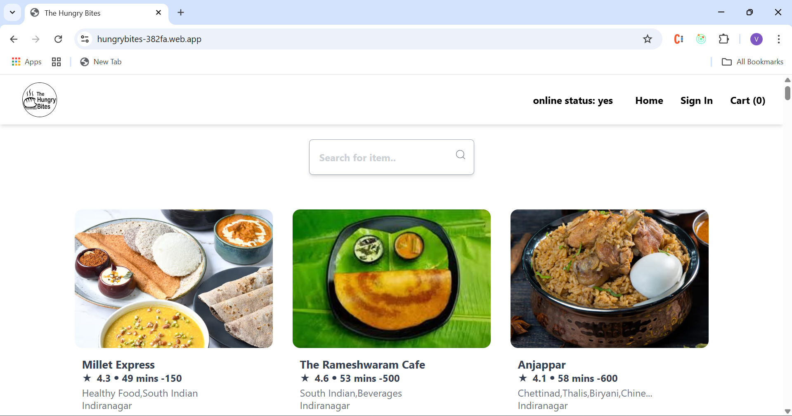
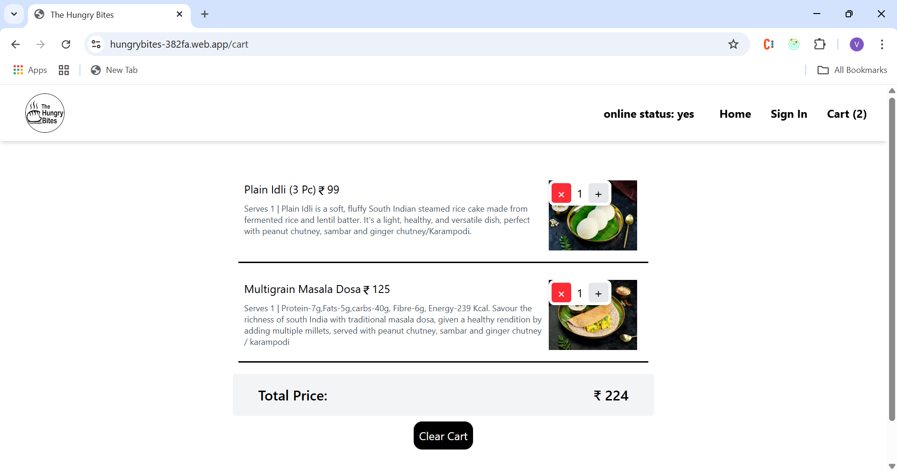
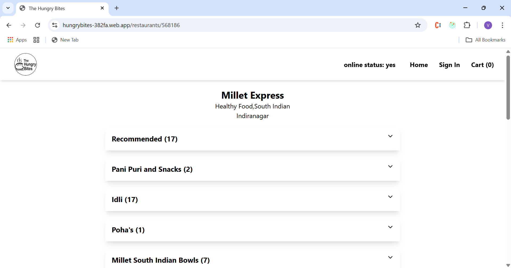

# 🍽️ The Hungry Bites

A modern, responsive food ordering web app built with React, Tailwind CSS, Redux, and Firebase.

---

## 🔗 Live Demo

👉 [https://hungrybites-382fa.web.app](https://hungrybites-382fa.web.app)

---

## 📌 Features

- 🔐 Google Sign-In using Firebase Authentication
- 📦 Real-time restaurant data (Swiggy API structure)
- 🛒 Add, remove, and update items in cart
- 💸 Dynamic quantity controls with price updates
- 🌐 Online/offline detection
- 💾 Persistent cart using `localStorage`
- ⚡ Shimmer UI for loading states
- 📱 Fully responsive design

---

## 🛠️ Tech Stack

- **React** (Functional Components + Hooks)
- **Tailwind CSS** – Utility-first styling
- **Redux Toolkit** – State management
- **React Router DOM** – Client-side routing
- **Firebase** – Authentication & Hosting
- **Parcel** – Bundler

---

## 📸 Screenshots

| Home Page | Cart Page | Restaurant Menu |
|-----------|-----------|-----------------|
|  |  |  |

---

## 📂 Project Structure

src/
├── components/ # UI Components
├── config/ # Firebase Config
├── utils/ # Custom hooks, Redux slices, constants
└── App.js # Root component


---

## 🚀 Getting Started

### 1. Clone the Repository

```bash
git clone git@github.com:VALARMATHISAMUVEL/The-hungry-bites.git
cd The-hungry-bites

2. Install dependencies
npm install

3. Start the development server
npm start

🔐 Environment Setup
Create a .env file in the root folder and add the following (replace with your Firebase values):
PARCEL_FIREBASE_API=your_api_key
PARCEL_FIREBASE_AUTHDOMAIN=your_project.firebaseapp.com
PARCEL_PROJECT_ID=your_project_id
PARCEL_STORAGE_BUCKET=your_bucket
PARCEL_MESS_SEND_ID=your_sender_id
PARCEL_APP_ID=your_app_id


🙋‍♀ Author
S. Valarmathi
Frontend Developer
GitHub Profile

📄 License
This project is open-source and free to use for learning and development purposes.


